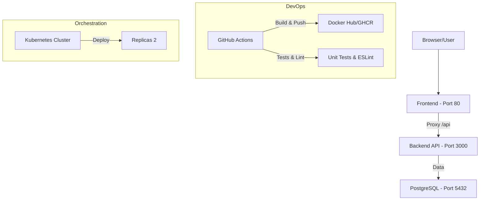

# 🏥 VitalSync - Suivi Médical et Sportif

Bienvenue dans le dépôt de VitalSync, la startup innovante pour le suivi de santé. Ce projet implémente une chaîne **CI/CD complète, conteneurisée et orchestrée**.

## 🏗️ Architecture Globale



## 🚀 Lancement Local (Docker Compose)

### Prérequis
*   **Docker** et **Docker Compose** installés.
*   Un fichier `.env` configuré (voir `.env.example`).

### Commandes
1.  **Préparer l'environnement** :
    ```bash
    cp .env.example .env
    ```
2.  **Démarrer les services** :
    ```bash
    docker-compose up --build -d
    ```
3.  **Vérifier le fonctionnement** :
    *   Front-end : `http://localhost`
    *   Health Check API : `http://localhost/api/health`

## ⛓️ Pipeline CI/CD

Notre pipeline GitHub Actions automatisée garantit la qualité du code à chaque étape :

1.  **Validation (Linter & Tests)** : Vérifie la syntaxe avec ESLint et lance les tests unitaires Jest. Échoue si la qualité n'est pas au rendez-vous.
2.  **Immuabilité (Build & Push)** : Construit les images Docker pour chaque service et les tague avec le **Commit SHA**. Cela assure une traçabilité totale (on sait quel code est sur quelle image).
3.  **Fiabilité (Deploy Staging)** : Simule un déploiement avec un **Health Check** final. Si le serveur répond mal après le déploiement, la pipeline s'arrête en erreur.

## ⚖️ Choix Techniques

*   **Multi-stage Build (Backend)** : Réduit la taille de l'image de ~80% et améliore la sécurité en supprimant les outils de build du conteneur final.
*   **Image Alpine** : Choix d'images minimales pour réduire la surface d'attaque et accélérer les déploiements.
*   **Kubernetes (K8s)** : Orchestration avec **2 réplicas** pour garantir une disponibilité continue même en cas de crash d'un pod (Self-healing).
*   **Ingress Controller** : Permet une gestion centralisée du trafic entrant et facilite le déploiement de domaines multiples.

---
*Projet réalisé dans le cadre de l'épreuve E6 - 2026 - VitalSync.*
